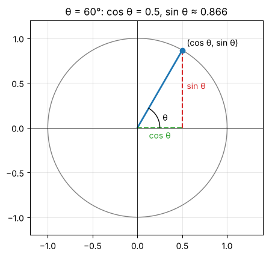
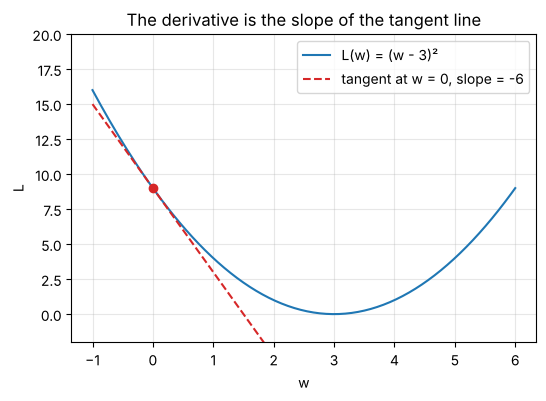

# Day 0: Reading maths symbols and refreshing the basics

**Anytime before Tue, Oct 6 · Refresher · about 60 minutes, or dip in when you need it**

If maths notation looks like a foreign alphabet right now, start here. This notebook does two things:

1. **Part A: a symbol dictionary.** For every symbol you'll meet in the prep plan and the course, it shows what it looks like, **how to say it out loud**, what it means, and a tiny example.
2. **Part B: the basics underneath everything.** Powers, roots, fractions, angles in radians, sin and cos, the Σ sum symbol, functions, and slopes, each with step-by-step examples.

Nothing here assumes you remember school maths. Keep this notebook open in another tab while you work through Days 1–11 and look things up as you go.

> **Tip:** reading a formula aloud is the fastest way to stop it looking scary. Every formula in this notebook comes with a "read it aloud" line.


```python
%matplotlib inline
import numpy as np
import matplotlib.pyplot as plt
np.set_printoptions(precision=4, suppress=True)
plt.rcParams.update({"figure.figsize": (5, 5), "axes.grid": True, "grid.alpha": 0.3})

def tex(label):
    """Typeset a ket label like '|+>' as a proper |+⟩ in plots."""
    if label.startswith("|") and label.endswith(">"):
        return r"$|" + label[1:-1] + r"\rangle$"
    return label
```

# Part A: The symbol dictionary

## A1. Greek letters you'll actually see
Maths uses Greek letters as names for quantities, just like variable names in code. They carry **no special meaning on their own**; the meaning comes from the context.

| Symbol | Say it | Typically used for in this course |
|---|---|---|
| α | "alpha" | amplitude of \|0⟩ in a qubit state |
| β | "beta" | amplitude of \|1⟩ in a qubit state |
| γ | "gamma" | an angle or a parameter in QAOA |
| δ, Δ | "delta" (small and capital) | a small change; Δx = "change in x" |
| ε | "epsilon" | a very small number, an error |
| η | "eta" | learning rate in gradient descent |
| θ | "theta" | an angle (rotation angle, Bloch sphere tilt) |
| λ | "lambda" | an eigenvalue |
| μ | "mu" | a mean (average) |
| π | "pie" | the constant 3.14159…, half a turn in radians |
| σ, Σ | "sigma" (small and capital) | σ = standard deviation or a Pauli matrix; Σ = "add these up" |
| φ (or ϕ) | "fee" or "fie" | a phase angle |
| ψ | "sigh" (like "psi") | a quantum state, written \|ψ⟩ |
| ω | "omega" | a frequency or a root of unity (Fourier transform) |


```python
# In Python you can use Greek letters as ordinary variable names:
θ = 0.5
λ = 3
print("theta =", θ, " lambda =", λ)
```

    theta = 0.5  lambda = 3


## A2. Everyday operators, written the maths way

| Symbol | Say it | Means | Example |
|---|---|---|---|
| a·b or ab | "a times b" | multiplication; often the dot or nothing at all | 3·4 = 12, and 2x means 2 × x |
| a/b or a over b | "a over b" | division | 6/3 = 2 |
| aⁿ or a^n | "a to the power n" | multiply a by itself n times | 2³ = 2·2·2 = 8 |
| √a | "square root of a" | the number that squares to a | √9 = 3 |
| \|x\| | "absolute value of x" or "modulus of x" | size of x, ignoring sign or direction | \|−5\| = 5, \|3 + 4i\| = 5 |
| ≈ | "approximately equal to" | close, not exact | π ≈ 3.14 |
| ≠ | "not equal to" | | 2 ≠ 3 |
| ≤, ≥ | "less than or equal to", "greater than or equal to" | | 0 ≤ P ≤ 1 |
| ± | "plus or minus" | two answers at once | √4 = ±2 means +2 or −2 |
| → | "maps to" or "goes to" | turns into | \|0⟩ → \|1⟩ means \|0⟩ becomes \|1⟩ |
| ⇒ | "implies" | so, therefore | x = 2 ⇒ x² = 4 |
| ∝ | "proportional to" | grows in step with | |
| ∞ | "infinity" | | |
| ∈ | "is in" or "belongs to" | membership | 3 ∈ {1, 2, 3} |
| ℝ, ℂ | "the reals", "the complex numbers" | sets of numbers | x ∈ ℝ means x is a real number |
| := or ≡ | "is defined as" | a definition, not a calculation | |

## A3. Subscripts, superscripts and indices
- **Subscript** (small, lowered): a **label**, like an array index. x₀, x₁, x₂ are "x sub zero", "x sub one", "x sub two", i.e. `x[0]`, `x[1]`, `x[2]`.
- **Superscript** (small, raised): usually a **power**. x² is "x squared", x³ "x cubed", xⁿ "x to the n".
- Sometimes a superscript is a **label** instead: A† ("A dagger"), Aᵀ ("A transpose"), z* ("z star" = conjugate). The symbol tells you which.
- **Two subscripts** mean a row and a column: Aᵢⱼ ("A sub i j") is the entry in row i, column j, i.e. `A[i][j]`.


```python
x = [10, 20, 30]           # x0 = 10, x1 = 20, x2 = 30
A = [[1, 2], [3, 4]]       # A01 = row 0, column 1 = 2
print("x1 =", x[1], "   A01 =", A[0][1], "   x squared for x=5:", 5**2)
```

    x1 = 20    A01 = 2    x squared for x=5: 25


## A4. Big operators: Σ (sum) and Π (product)

**Σ** means "add up a list of terms". Read

  Σₖ₌₁⁵ k

aloud as **"the sum, for k from 1 to 5, of k"**. The bottom says where the counter starts, the top says where it stops, and the right-hand side is what you add each time:

  Σₖ₌₁⁵ k = 1 + 2 + 3 + 4 + 5 = 15

It's just a for-loop:
```python
total = 0
for k in range(1, 6):
    total += k
```
**Π** works the same way but multiplies: Πₖ₌₁⁴ k = 1·2·3·4 = 24.


```python
print("sum k for k=1..5   :", sum(k for k in range(1, 6)))
print("sum k^2 for k=1..3 :", sum(k**2 for k in range(1, 4)), " (= 1 + 4 + 9)")
print("product k, k=1..4  :", np.prod(range(1, 5)))
```

    sum k for k=1..5   : 15
    sum k^2 for k=1..3 : 14  (= 1 + 4 + 9)
    product k, k=1..4  : 24


## A5. Complex-number symbols (Day 1)

| Symbol | Say it | Means |
|---|---|---|
| i | "i" | the imaginary unit, defined by i² = −1. Python writes it `1j` |
| a + bi | "a plus b i" | a complex number: real part a, imaginary part b |
| Re(z), Im(z) | "real part of z", "imaginary part of z" | a and b |
| z* or z̄ | "z star" or "z bar" | complex conjugate: flip the sign of the imaginary part |
| \|z\| | "mod z" or "modulus of z" | the length √(a² + b²) |
| e | "e" | Euler's number, 2.71828… |
| e^(iθ) | "e to the i theta" | the point on the unit circle at angle θ: cos θ + i sin θ |

## A6. Vector and matrix symbols (Days 2–4)

| Symbol | Say it | Means |
|---|---|---|
| **v** or v⃗ | "vector v" | a list of numbers, like a 1-D array |
| (1, 2, 3) or a column | | a vector written out |
| ⟨u, v⟩ or u·v | "the inner product of u and v", "u dot v" | multiply matching entries and add up (conjugate u first if complex) |
| ‖v‖ | "the norm of v" | the length of v |
| A, M, U, H | "matrix A" … | capital letters usually mean matrices |
| Av | "A times v" | matrix-vector product |
| Aᵀ | "A transpose" | rows become columns |
| A† | "A dagger" | transpose **and** conjugate every entry |
| A⁻¹ | "A inverse" | the matrix that undoes A |
| I | "the identity" | the do-nothing matrix: 1s on the diagonal, 0s elsewhere |
| det(A) | "determinant of A" | a single number from a square matrix; for 2×2, ad − bc |
| λ | "lambda" | an eigenvalue: Av = λv |
| ⊗ | "tensor" or "kron" | tensor (Kronecker) product, how you combine qubits |

## A7. Quantum (Dirac) notation (Days 7–11)
Paul Dirac invented a bracket notation that everyone in quantum computing uses. It looks odd, but it's only vectors.

| Symbol | Say it | Means |
|---|---|---|
| \|ψ⟩ | "ket psi" | a column vector, the quantum state ψ |
| ⟨ψ\| | "bra psi" | the same vector as a row, with every entry conjugated |
| ⟨φ\|ψ⟩ | "bra-ket phi psi" or "the inner product of phi and psi" | a single number: how much the two states overlap |
| \|ψ⟩⟨φ\| | "ket psi bra phi" | an outer product, which is a matrix |
| \|0⟩, \|1⟩ | "ket zero", "ket one" | the two basic qubit states: (1, 0) and (0, 1) |
| \|+⟩, \|−⟩ | "ket plus", "ket minus" | (\|0⟩ + \|1⟩)/√2 and (\|0⟩ − \|1⟩)/√2 |
| \|00⟩, \|01⟩ … | "ket zero zero" … | two-qubit basis states |
| ⟨Z⟩ | "expectation value of Z" | the average measurement result |
| X, Y, Z, H | "the X gate" … | the Pauli gates and the Hadamard gate, all 2×2 matrices |

## A8. Calculus and probability symbols (Days 5–6)

| Symbol | Say it | Means |
|---|---|---|
| f(x) | "f of x" | a function: give it x, get a number back |
| df/dx or f′(x) | "d f by d x" or "f prime of x" | the derivative: slope of f at x |
| ∂L/∂w | "partial L by partial w" | the slope of L when only w changes |
| ∇L | "grad L" or "nabla L" | the list of all partial derivatives: the gradient |
| P(A) | "probability of A" | a number between 0 and 1 |
| E[X] | "expected value of X" or "expectation of X" | the long-run average |
| Var(X) | "variance of X" | spread around the average |
| w ← w − η·g | "w becomes w minus eta times g" | an update step, like `w = w - eta * g` in code |

# Part B: The basics underneath everything

## B1. Powers and roots
- xⁿ means x multiplied by itself n times: 3⁴ = 3·3·3·3 = 81.
- x⁰ = 1 for any x ≠ 0. (Dividing x³ by x³ leaves 1, and the exponent rule gives x³⁻³ = x⁰.)
- x⁻ⁿ = 1/xⁿ, so 2⁻¹ = 1/2 and 10⁻³ = 0.001.
- x^(1/2) = √x, so 9^(1/2) = 3.

**The three exponent rules you'll use most**
1. xᵃ · xᵇ = xᵃ⁺ᵇ  (multiplying adds the powers): 2² · 2³ = 4 · 8 = 32 = 2⁵ ✓
2. (xᵃ)ᵇ = xᵃᵇ  (a power of a power multiplies): (2²)³ = 4³ = 64 = 2⁶ ✓
3. (xy)ⁿ = xⁿyⁿ: (2·3)² = 36 = 4·9 ✓

The first rule is why e^(iα) · e^(iβ) = e^(i(α+β)): multiplying two rotations adds their angles (Day 1).


```python
print("2^2 * 2^3 =", 2**2 * 2**3, " and 2^5 =", 2**5)
print("(2^2)^3   =", (2**2)**3, " and 2^6 =", 2**6)
print("2^-1 =", 2**-1, "   9^(1/2) =", 9**0.5)
```

    2^2 * 2^3 = 32  and 2^5 = 32
    (2^2)^3   = 64  and 2^6 = 64
    2^-1 = 0.5    9^(1/2) = 3.0


## B2. Square roots and the famous 1/√2
1/√2 shows up everywhere in quantum computing, because (1/√2)² = 1/2 and two halves make 1.

- √2 ≈ 1.41421, so 1/√2 ≈ 0.70711.
- **Rationalising:** 1/√2 = √2/2 (multiply top and bottom by √2). Both forms appear in textbooks; they're the same number.
- √(a·b) = √a · √b, so √8 = √4 · √2 = 2√2.
- But **√(a + b) is NOT √a + √b**: √(9 + 16) = √25 = 5, not 3 + 4 = 7.


```python
print("1/sqrt(2)      =", 1 / np.sqrt(2))
print("sqrt(2)/2      =", np.sqrt(2) / 2)
print("(1/sqrt(2))^2  =", (1 / np.sqrt(2))**2)
print("sqrt(9+16) =", np.sqrt(9 + 16), " but sqrt(9)+sqrt(16) =", np.sqrt(9) + np.sqrt(16))
```

    1/sqrt(2)      = 0.7071067811865475
    sqrt(2)/2      = 0.7071067811865476
    (1/sqrt(2))^2  = 0.4999999999999999
    sqrt(9+16) = 5.0  but sqrt(9)+sqrt(16) = 7.0


## B3. Fractions, step by step
- **Add with a common bottom:** 1/2 + 1/3 = 3/6 + 2/6 = 5/6.
- **Multiply straight across:** (2/3) · (3/4) = 6/12 = 1/2.
- **Divide by a fraction = multiply by its flip:** (1/2) ÷ (1/4) = (1/2) · (4/1) = 2.
- **A number times a fraction:** 3 · (1/√2) = 3/√2.


```python
from fractions import Fraction as F
print("1/2 + 1/3 =", F(1, 2) + F(1, 3))
print("2/3 * 3/4 =", F(2, 3) * F(3, 4))
print("(1/2) / (1/4) =", F(1, 2) / F(1, 4))
```

    1/2 + 1/3 = 5/6
    2/3 * 3/4 = 1/2
    (1/2) / (1/4) = 2


## B4. Angles: degrees and radians
A full turn is **360°** or **2π radians**. Radians are the default in maths and in NumPy.

| Degrees | Radians | Fraction of a turn |
|---|---|---|
| 0° | 0 | none |
| 45° | π/4 | an eighth |
| 90° | π/2 | a quarter |
| 180° | π | a half |
| 270° | 3π/2 | three quarters |
| 360° | 2π | a full turn |

**Convert:** radians = degrees × π/180, and degrees = radians × 180/π.


```python
for deg in [0, 45, 90, 180, 360]:
    print(f"{deg:>3} deg = {np.radians(deg):.4f} rad = {np.radians(deg)/np.pi:.2f} pi")
```

      0 deg = 0.0000 rad = 0.00 pi
     45 deg = 0.7854 rad = 0.25 pi
     90 deg = 1.5708 rad = 0.50 pi
    180 deg = 3.1416 rad = 1.00 pi
    360 deg = 6.2832 rad = 2.00 pi


## B5. sin and cos are just coordinates on a circle
Draw a circle of radius 1 around the origin. Walk anticlockwise from the point (1, 0) through an angle θ.
The point you land on has coordinates **(cos θ, sin θ)**. That's the whole definition.

- cos θ = how far across (x-coordinate)
- sin θ = how far up (y-coordinate)
- Because the point is on a circle of radius 1: **cos²θ + sin²θ = 1** always (Pythagoras).


```python
theta = np.radians(60)
t = np.linspace(0, 2 * np.pi, 300)
fig, ax = plt.subplots()
ax.plot(np.cos(t), np.sin(t), color="gray", lw=1)
px, py = np.cos(theta), np.sin(theta)
ax.plot([0, px], [0, py], color="C0", lw=2)
ax.plot([px, px], [0, py], "C3--", lw=1.5); ax.plot([0, px], [0, 0], "C2--", lw=1.5)
ax.text(px / 2, -0.12, "cos θ", color="C2", ha="center"); ax.text(px + 0.05, py / 2, "sin θ", color="C3")
ax.scatter([px], [py], color="C0", zorder=3); ax.text(px + 0.05, py + 0.05, "(cos θ, sin θ)")
arc = np.linspace(0, theta, 30); ax.plot(0.25 * np.cos(arc), 0.25 * np.sin(arc), color="k", lw=1); ax.text(0.28, 0.08, "θ")
ax.axhline(0, color="k", lw=0.6); ax.axvline(0, color="k", lw=0.6)
ax.set_xlim(-1.2, 1.4); ax.set_ylim(-1.2, 1.2); ax.set_aspect("equal"); ax.set_title("θ = 60°: cos θ = 0.5, sin θ ≈ 0.866")
plt.show()
```


    

    


### The values worth knowing by heart

| θ | cos θ | sin θ |
|---|---|---|
| 0 | 1 | 0 |
| π/6 (30°) | √3/2 ≈ 0.866 | 1/2 |
| π/4 (45°) | 1/√2 ≈ 0.707 | 1/√2 ≈ 0.707 |
| π/3 (60°) | 1/2 | √3/2 ≈ 0.866 |
| π/2 (90°) | 0 | 1 |
| π (180°) | −1 | 0 |


```python
for name, th in [("0", 0), ("pi/6", np.pi/6), ("pi/4", np.pi/4), ("pi/3", np.pi/3), ("pi/2", np.pi/2), ("pi", np.pi)]:
    print(f"{name:>5}: cos = {np.cos(th):+.4f}  sin = {np.sin(th):+.4f}  cos^2+sin^2 = {np.cos(th)**2 + np.sin(th)**2:.4f}")
```

        0: cos = +1.0000  sin = +0.0000  cos^2+sin^2 = 1.0000
     pi/6: cos = +0.8660  sin = +0.5000  cos^2+sin^2 = 1.0000
     pi/4: cos = +0.7071  sin = +0.7071  cos^2+sin^2 = 1.0000
     pi/3: cos = +0.5000  sin = +0.8660  cos^2+sin^2 = 1.0000
     pi/2: cos = +0.0000  sin = +1.0000  cos^2+sin^2 = 1.0000
       pi: cos = -1.0000  sin = +0.0000  cos^2+sin^2 = 1.0000


## B6. Reading Σ with an example you'll meet again
The inner product of two vectors u and v is often written

  ⟨u, v⟩ = Σₖ uₖ vₖ

**Read it aloud:** "the inner product of u and v equals the sum over k of u-sub-k times v-sub-k".
**In plain words:** multiply the first entries, multiply the second entries, and so on, then add the results.

Worked example with u = (1, 2, 3) and v = (4, 5, 6):
- k = 0: u₀v₀ = 1 × 4 = 4
- k = 1: u₁v₁ = 2 × 5 = 10
- k = 2: u₂v₂ = 3 × 6 = 18
- Sum: 4 + 10 + 18 = **32**


```python
u, v = np.array([1, 2, 3]), np.array([4, 5, 6])
terms = [u[k] * v[k] for k in range(3)]
print("terms:", terms, "  sum:", sum(terms), "  numpy:", u @ v)
```

    terms: [np.int64(4), np.int64(10), np.int64(18)]   sum: 32   numpy: 32


## B7. Functions
f(x) = x² + 1 reads "f of x equals x squared plus one". It's a rule: plug in a number for x, get a number out.
- f(2) = 2² + 1 = 5
- f(−3) = (−3)² + 1 = 9 + 1 = 10 (careful: a negative number squared is positive)

It's exactly a Python function.


```python
def f(x):
    return x**2 + 1
print("f(2) =", f(2), "  f(-3) =", f(-3))
```

    f(2) = 5   f(-3) = 10


## B8. Slope and the derivative (needed for Day 6)
The **slope** of a straight line is "rise over run": how much y goes up for each step right.
For a curve, the slope changes from point to point. The **derivative** f′(x) (read "f prime of x") is the slope at the point x.

**The one rule you need:** the derivative of xⁿ is n·xⁿ⁻¹ ("bring the power down, reduce it by one").
- f(x) = x² gives f′(x) = 2x. At x = 3 the slope is 6.
- f(x) = x³ gives f′(x) = 3x².
- A constant has slope 0.

**With a shift inside:** for L(w) = (w − 3)², the derivative is 2(w − 3). At w = 0 that's −6: the curve slopes **down** to the right, so we should move w to the right to go downhill. That's gradient descent in one sentence.


```python
def L(w): return (w - 3)**2
w0 = 0.0
slope = 2 * (w0 - 3)
grid = np.linspace(-1, 6, 200)
fig, ax = plt.subplots(figsize=(6, 4))
ax.plot(grid, L(grid), label="L(w) = (w - 3)²")
ax.plot(grid, L(w0) + slope * (grid - w0), "C3--", label=f"tangent at w = 0, slope = {slope:.0f}")
ax.scatter([w0], [L(w0)], color="C3", zorder=3)
ax.set_ylim(-2, 20); ax.set_xlabel("w"); ax.set_ylabel("L"); ax.legend(); ax.set_title("The derivative is the slope of the tangent line")
plt.show()

h = 1e-6
print("numerical slope at w=0:", (L(w0 + h) - L(w0)) / h, "  formula 2(w-3):", slope)
```


    

    


    numerical slope at w=0: -5.999999000749767   formula 2(w-3): -6.0


## B9. How to read a formula you've never seen
Use this routine on any formula in the course:
1. **Name every symbol.** Look each one up in Part A.
2. **Read it aloud**, left to right, in words.
3. **Find the shape.** Is it a sum? A product? A function of something?
4. **Plug in tiny numbers** (0, 1, 2) and work it out by hand.
5. **Check in Python.**

**Try it on:** P(0) = |α|²
1. P(0) is "the probability of measuring 0"; α is "alpha", the amplitude of |0⟩; |α| is "the modulus of alpha".
2. "The probability of zero equals the modulus of alpha, squared."
3. It's a single squared quantity.
4. If α = 1/√2: |α| = 1/√2 ≈ 0.707, squared = 1/2. So P(0) = 0.5.
5. Check below.


```python
alpha = 1 / np.sqrt(2)
print("P(0) =", abs(alpha)**2)
```

    P(0) = 0.4999999999999999


## Exercises
**E1.** Read aloud: Σₖ₌₀³ 2ᵏ. Then compute it.

**E2.** Read aloud and compute: |3 − 4i|.

**E3.** Convert 135° to radians, and give cos and sin of that angle.

**E4.** What is the derivative of f(x) = 5x²? What is the slope at x = 2?

**E5.** Simplify (1/√2)² + (1/√2)².


```python
# Your turn
```

<details>
<summary><b>Show worked solution</b></summary>

**E1.** "The sum, for k from 0 to 3, of 2 to the power k." = 2⁰ + 2¹ + 2² + 2³ = 1 + 2 + 4 + 8 = **15**.

**E2.** "The modulus of three minus four i." = √(3² + (−4)²) = √(9 + 16) = √25 = **5**.

**E3.** 135 × π/180 = **3π/4** radians. That's in the upper-left quarter of the circle, so cos is negative and sin is positive: cos = **−1/√2 ≈ −0.707**, sin = **1/√2 ≈ 0.707**.

**E4.** Bring the power down: f′(x) = 5 · 2x = **10x**. At x = 2 the slope is **20**.

**E5.** 1/2 + 1/2 = **1**. This is why a state with amplitudes (1/√2, 1/√2) is properly normalised.

</details>


```python
assert sum(2**k for k in range(0, 4)) == 15
assert np.isclose(abs(3 - 4j), 5)
assert np.isclose(np.radians(135), 3 * np.pi / 4)
assert np.isclose(np.cos(3 * np.pi / 4), -1 / np.sqrt(2)) and np.isclose(np.sin(3 * np.pi / 4), 1 / np.sqrt(2))
h = 1e-6; assert np.isclose((5 * (2 + h)**2 - 5 * 2**2) / h, 20, atol=1e-3)
assert np.isclose(2 * (1 / np.sqrt(2))**2, 1)
print("All Day 0 checks passed.")
```

    All Day 0 checks passed.


---
### Recap checklist
Tick these off in your head before moving on. If any feel shaky, re-run the relevant section with your own numbers.

**Next:** Day 1: Complex numbers

*Part of the IIT Delhi CEP Applied Quantum Computing & AI prep plan: [prep-plan.md](../plan/prep-plan.md)*
