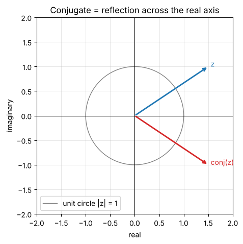
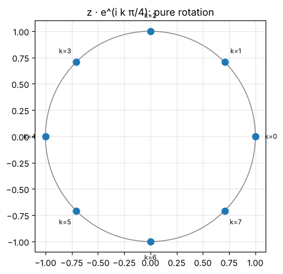

# Day 1: Complex numbers

**Tue, Oct 6 · Prep · about 45 minutes**

Every amplitude in a quantum state is a complex number. Today is about getting fluent with them, both as algebra and as points on a plane.

**By the end of this notebook you can:**
- Add, multiply and conjugate complex numbers
- Move between a + bi and polar form r·e^(iθ)
- Explain why |z| = 1 numbers matter for qubits

> How to use this notebook: read each explanation, run the cell under it, then change the numbers and run it again.
> The exercises at the end have a "your turn" cell and a hidden worked solution. Try first, then check.


```python
%matplotlib inline
import numpy as np
import matplotlib.pyplot as plt
np.set_printoptions(precision=4, suppress=True)
plt.rcParams.update({"figure.figsize": (5, 5), "axes.grid": True, "grid.alpha": 0.3})

def tex(label):
    """Typeset a ket label like '|+>' as a proper |+⟩ in plots."""
    if label.startswith("|") and label.endswith(">"):
        return r"$|" + label[1:-1] + r"\rangle$"
    return label
```

## 1. A complex number is a point on a plane
`z = a + bi` has a **real part** `a` and an **imaginary part** `b`, where `i² = −1`.
Plot `a` on the horizontal axis and `b` on the vertical axis and every complex number becomes a point (or an arrow from the origin).

Python has complex numbers built in; it writes `i` as `j`.


```python
z = 3 + 4j
print("z =", z)
print("real part:", z.real, " imaginary part:", z.imag)
print("i squared:", 1j * 1j)
```

    z = (3+4j)
    real part: 3.0  imaginary part: 4.0
    i squared: (-1+0j)


## 2. Arithmetic
- **Add** component by component: (1 + 2i) + (3 − i) = 4 + i
- **Multiply** like brackets, then use i² = −1: (1 + 2i)(3 − i) = 3 − i + 6i − 2i² = 5 + 5i
- **Conjugate** flips the sign of the imaginary part: conj(a + bi) = a − bi (a reflection across the real axis)


```python
w1, w2 = 1 + 2j, 3 - 1j
print("sum:       ", w1 + w2)
print("product:   ", w1 * w2)
print("conjugate: ", np.conj(w1))
```

    sum:        (4+1j)
    product:    (5+5j)
    conjugate:  (1-2j)


## 3. Modulus: the length of the arrow
`|z| = √(a² + b²)`. A neat identity you'll use constantly: **z · conj(z) = |z|²**, always a real number.
In quantum computing, |amplitude|² is a probability, so this identity is how probabilities come out of complex amplitudes.


```python
z = 3 + 4j
print("|z| =", abs(z))
print("z * conj(z) =", z * np.conj(z), "  (equals |z|^2 =", abs(z)**2, ")")
```

    |z| = 5.0
    z * conj(z) = (25+0j)   (equals |z|^2 = 25.0 )


## 4. Polar form and Euler's formula
Any point can also be described by its length `r` and its angle `θ` from the positive real axis:

`z = r(cos θ + i sin θ) = r·e^(iθ)`

The second equality is **Euler's formula**, e^(iθ) = cos θ + i sin θ. It turns rotation into multiplication:
multiplying by e^(iθ) rotates a number by θ without changing its length. Quantum gates use exactly this.


```python
z = 1 + 1j
r, theta = abs(z), np.angle(z)
print(f"r = {r:.4f}, theta = {theta:.4f} rad = {np.degrees(theta):.1f} deg")
print("back to a+bi:", r * np.exp(1j * theta))
```

    r = 1.4142, theta = 0.7854 rad = 45.0 deg
    back to a+bi: (1.0000000000000002+1j)


### Picture it: a number, its conjugate, and the unit circle


```python
z = 1.5 + 1.0j
t = np.linspace(0, 2*np.pi, 300)
fig, ax = plt.subplots()
ax.plot(np.cos(t), np.sin(t), lw=1, color="gray", label="unit circle |z| = 1")
for val, lab, c in [(z, "z", "C0"), (np.conj(z), "conj(z)", "C3")]:
    ax.annotate("", xy=(val.real, val.imag), xytext=(0, 0), arrowprops=dict(arrowstyle="->", color=c, lw=2))
    ax.text(val.real + 0.05, val.imag, lab, color=c)
ax.axhline(0, color="k", lw=0.8); ax.axvline(0, color="k", lw=0.8)
ax.set_xlim(-2, 2); ax.set_ylim(-2, 2); ax.set_aspect("equal")
ax.set_xlabel("real"); ax.set_ylabel("imaginary"); ax.legend(loc="lower left")
ax.set_title("Conjugate = reflection across the real axis")
plt.show()
```


    

    


### Rotation by multiplying with e^(iθ)
Below, the same point is multiplied by e^(iπ/4) eight times. Each step rotates it 45° and the length never changes.


```python
z = 1 + 0j
pts = [z * np.exp(1j * k * np.pi / 4) for k in range(8)]
fig, ax = plt.subplots()
ax.plot(np.cos(t), np.sin(t), lw=1, color="gray")
ax.scatter([p.real for p in pts], [p.imag for p in pts], s=60, zorder=3)
for k, p in enumerate(pts):
    ax.text(p.real * 1.15, p.imag * 1.15, f"k={k}", ha="center", va="center", fontsize=8)
ax.set_aspect("equal"); ax.set_title("z · e^(i k π/4): pure rotation")
plt.show()
print("lengths:", [round(abs(p), 6) for p in pts])
```


    

    


    lengths: [np.float64(1.0), np.float64(1.0), np.float64(1.0), np.float64(1.0), np.float64(1.0), np.float64(1.0), np.float64(1.0), np.float64(1.0)]


## 5. Why this matters for qubits
A qubit state is `α|0⟩ + β|1⟩` with complex α and β. The probabilities are |α|² and |β|², and they must add to 1.
Two states that differ only by multiplying everything by e^(iθ) (a **global phase**) give identical probabilities. You'll meet this again on Day 11.

## Exercises
**E1.** Write (1 + i)/√2 in polar form and show its modulus is 1.

**E2.** Compute (2 + 3i)(2 − 3i). Why is the answer real?

**E3.** What happens to a complex number when you multiply it by i? Describe it as a rotation.


```python
# Your turn: use Python to check your hand-worked answers
z = (1 + 1j) / np.sqrt(2)
# print(abs(z), np.angle(z))
```

<details>
<summary><b>Show worked solution</b></summary>

**E1.** a = b = 1/√2, so r = √(1/2 + 1/2) = 1 and θ = arctan(1) = π/4. So (1 + i)/√2 = e^(iπ/4).

**E2.** (2 + 3i)(2 − 3i) = 4 − 6i + 6i − 9i² = 4 + 9 = 13. A number times its conjugate is always |z|², which is real.

**E3.** i = e^(iπ/2), so multiplying by i rotates the arrow 90° anticlockwise. Example: 1 → i → −1 → −i → 1.

</details>


```python
# Automatic check of the solutions
z = (1 + 1j) / np.sqrt(2)
assert np.isclose(abs(z), 1) and np.isclose(np.angle(z), np.pi / 4)
assert (2 + 3j) * (2 - 3j) == 13
assert np.isclose(1j * (1 + 0j), np.exp(1j * np.pi / 2))
print("All Day 1 checks passed.")
```

    All Day 1 checks passed.


---
### Recap checklist
Tick these off in your head before moving on. If any feel shaky, re-run the relevant section with your own numbers.

**Next:** Day 2: Linear algebra 1, vectors and inner products

*Part of the IIT Delhi CEP Applied Quantum Computing & AI prep plan: [prep-plan.md](../plan/prep-plan.md)*
