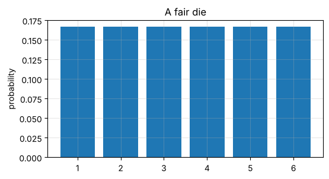
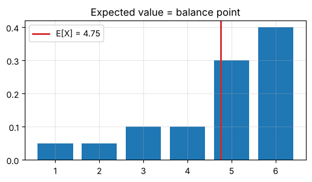
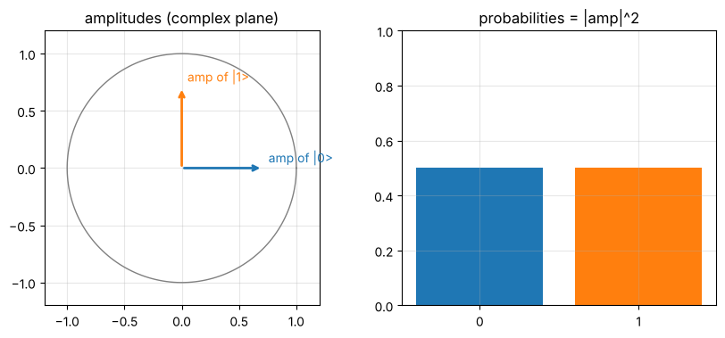
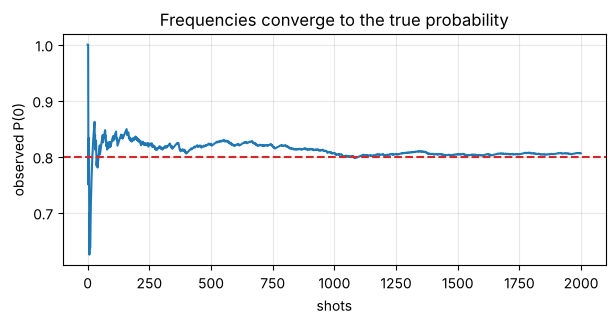

# Day 5: Probability: distributions and expectation

**Sat, Oct 10 · Prep · about 90 minutes**

Quantum computers don't hand you a single answer; they hand you samples from a probability distribution. Today you connect amplitudes (Days 1–2) to probabilities and to what you actually see when you run a circuit.

**By the end of this notebook you can:**
- Describe a discrete probability distribution and check it's normalised
- Compute an expected value and a variance
- Turn complex amplitudes into probabilities with the Born rule
- Simulate repeated measurements and watch counts converge

> How to use this notebook: read each explanation, run the cell under it, then change the numbers and run it again.
> The exercises at the end have a "your turn" cell and a hidden worked solution. Try first, then check.


```python
%matplotlib inline
import numpy as np
import matplotlib.pyplot as plt
np.set_printoptions(precision=4, suppress=True)
plt.rcParams.update({"figure.figsize": (5, 5), "axes.grid": True, "grid.alpha": 0.3})

def tex(label):
    """Typeset a ket label like '|+>' as a proper |+⟩ in plots."""
    if label.startswith("|") and label.endswith(">"):
        return r"$|" + label[1:-1] + r"\rangle$"
    return label
rng = np.random.default_rng(7)
```

## 1. Discrete distributions
A distribution lists outcomes and their probabilities. Two rules: every probability is ≥ 0, and they **sum to 1**.


```python
outcomes = np.array([1, 2, 3, 4, 5, 6])
p = np.full(6, 1 / 6)
print("sums to 1?", np.isclose(p.sum(), 1))
plt.figure(figsize=(6, 3)); plt.bar(outcomes, p); plt.title("A fair die"); plt.ylabel("probability"); plt.show()
```

    sums to 1? True


    

    


## 2. Expected value and variance
**E[X] = Σ xₖ pₖ** is the long-run average: the balance point of the distribution.
**Var[X] = E[X²] − E[X]²** measures spread.


```python
E = (outcomes * p).sum(); Var = (outcomes**2 * p).sum() - E**2
print(f"E[X] = {E:.4f}, Var[X] = {Var:.4f}")

skewed = np.array([0.05, 0.05, 0.1, 0.1, 0.3, 0.4])
E2 = (outcomes * skewed).sum()
plt.figure(figsize=(6, 3)); plt.bar(outcomes, skewed); plt.axvline(E2, color="C3", lw=2, label=f"E[X] = {E2:.2f}")
plt.title("Expected value = balance point"); plt.legend(); plt.show()
```

    E[X] = 3.5000, Var[X] = 2.9167


    

    


## 3. The Born rule: amplitudes → probabilities
A qubit state α|0⟩ + β|1⟩ is measured as 0 with probability **|α|²** and as 1 with probability **|β|²**.
Phases don't change these probabilities: α = 1/√2 and α = i/√2 both give 1/2.


```python
amps = np.array([1 / np.sqrt(2), 1j / np.sqrt(2)])
probs = np.abs(amps) ** 2
print("probabilities:", probs, " sum:", probs.sum())

fig, (a1, a2) = plt.subplots(1, 2, figsize=(10, 4))
t = np.linspace(0, 2 * np.pi, 200); a1.plot(np.cos(t), np.sin(t), color="gray", lw=1)
for k, (amp, c) in enumerate(zip(amps, ["C0", "C1"])):
    a1.annotate("", xy=(amp.real, amp.imag), xytext=(0, 0), arrowprops=dict(arrowstyle="->", color=c, lw=2))
    a1.text(amp.real + 0.05, amp.imag + 0.05, f"amp of |{k}>", color=c)
a1.set_aspect("equal"); a1.set_xlim(-1.2, 1.2); a1.set_ylim(-1.2, 1.2); a1.set_title("amplitudes (complex plane)")
a2.bar(["0", "1"], probs, color=["C0", "C1"]); a2.set_ylim(0, 1); a2.set_title("probabilities = |amp|^2")
plt.show()
```

    probabilities: [0.5 0.5]  sum: 0.9999999999999998


    

    


## 4. What you actually see: sampling
Run the "circuit" N times and count outcomes. With more shots, the observed frequencies settle on the true probabilities.
This is why real quantum results are reported as **counts**, e.g. `{'0': 507, '1': 493}`.


```python
probs = np.array([0.8, 0.2])
for shots in [10, 100, 1000, 10000]:
    samples = rng.choice([0, 1], size=shots, p=probs)
    print(f"{shots:>6} shots -> freq of 0 = {np.mean(samples == 0):.3f}  (true 0.8)")

running = np.cumsum(rng.choice([0, 1], size=2000, p=probs) == 0) / np.arange(1, 2001)
plt.figure(figsize=(7, 3)); plt.plot(running); plt.axhline(0.8, color="C3", ls="--")
plt.xlabel("shots"); plt.ylabel("observed P(0)"); plt.title("Frequencies converge to the true probability"); plt.show()
```

        10 shots -> freq of 0 = 0.700  (true 0.8)
       100 shots -> freq of 0 = 0.810  (true 0.8)
      1000 shots -> freq of 0 = 0.802  (true 0.8)
     10000 shots -> freq of 0 = 0.793  (true 0.8)


    

    


## 5. Expected value of a measurement
If outcome 0 is labelled +1 and outcome 1 is labelled −1, then E = (+1)·P(0) + (−1)·P(1) = P(0) − P(1).
This is the **expectation value ⟨Z⟩** you'll compute constantly in variational algorithms (Module 8).

## Exercises
**E1.** For amplitudes (1/√2, i/√2), give P(0) and P(1).

**E2.** With outcome values +1 for 0 and −1 for 1, compute the expected value for E1's state.

**E3.** A state has amplitudes (√3/2, 1/2). Compute P(0), P(1) and the ±1 expected value. Then simulate 5000 shots and compare.


```python
# Your turn
```

<details>
<summary><b>Show worked solution</b></summary>

**E1.** P(0) = |1/√2|² = 1/2, P(1) = |i/√2|² = |i|²/2 = 1/2.

**E2.** E = (+1)(1/2) + (−1)(1/2) = 0.

**E3.** P(0) = 3/4, P(1) = 1/4, E = 3/4 − 1/4 = 1/2. With 5000 shots expect about 3750 zeros, give or take ~30.

</details>


```python
amps = np.array([1, 1j]) / np.sqrt(2); pr = np.abs(amps) ** 2
assert np.allclose(pr, [0.5, 0.5]) and np.isclose(pr[0] - pr[1], 0)
amps = np.array([np.sqrt(3) / 2, 1 / 2]); pr = np.abs(amps) ** 2
assert np.allclose(pr, [0.75, 0.25]) and np.isclose(pr[0] - pr[1], 0.5)
s = rng.choice([1, -1], size=5000, p=pr)
print("simulated E =", s.mean(), "(true 0.5)")
print("All Day 5 checks passed.")
```

    simulated E = 0.492 (true 0.5)
    All Day 5 checks passed.


---
### Recap checklist
Tick these off in your head before moving on. If any feel shaky, re-run the relevant section with your own numbers.

**Next:** Day 6: AI/ML maths bridge

*Part of the IIT Delhi CEP Applied Quantum Computing & AI prep plan: [prep-plan.md](../plan/prep-plan.md)*
